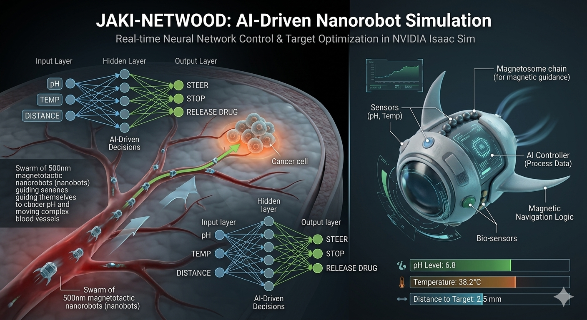

# 🧬 Jaki-Netwood: AI-Driven Nanorobot Simulation

  
   
  <h2 style="color: #00ffcc; font-family: monospace; letter-spacing: 2px;">NEURAL NETWORK CONTROL SYSTEM</h2>

---

## 🛠️ System Architecture & Interfaces
:

<table align="center">
  <tr>
    <td align="center" width="50%">
       
      <strong>⚡ Sci-Fi Mode</strong> 
      <em>Active Mission Tracking</em>
    </td>
    <td align="center" width="50%">
       
      <strong>📊 Baseline Mode</strong> 
      <em>System Diagnostics</em>
    </td>
  </tr>
</table>

---

## 🧠 Technical Specifications

* **Nano-Agent:** 500nm magnetotactic robots.
* **AI Logic:** Multi-layer Neural Network (Input: pH, Temp, Dist | Output: Steer, Release).
* **Environment:** High-fidelity blood vessel simulation in **NVIDIA Isaac Sim**.

---

  
<strong>© 2026 Jaki-Netwood Innovation Lab</strong>

  

